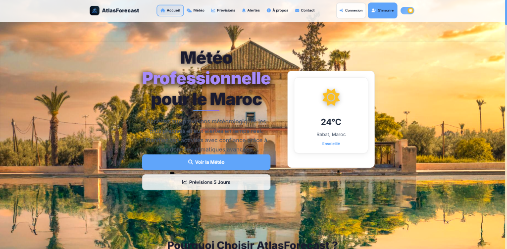
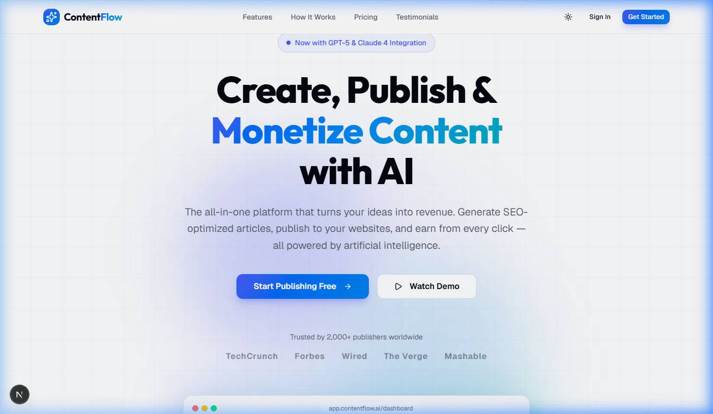
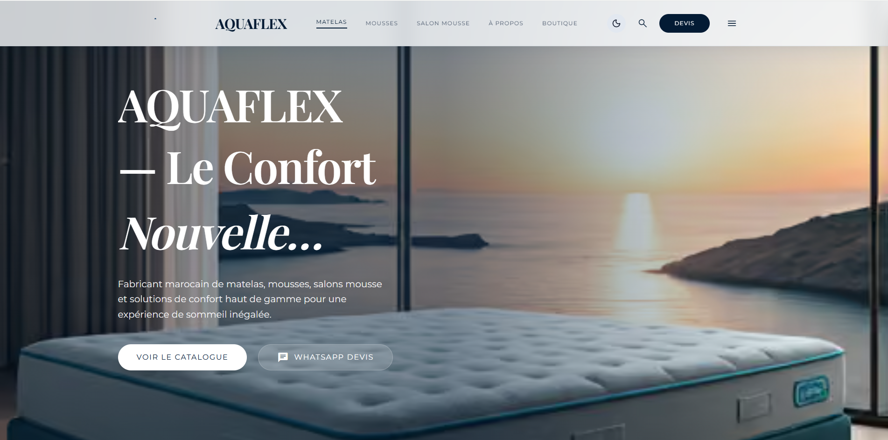
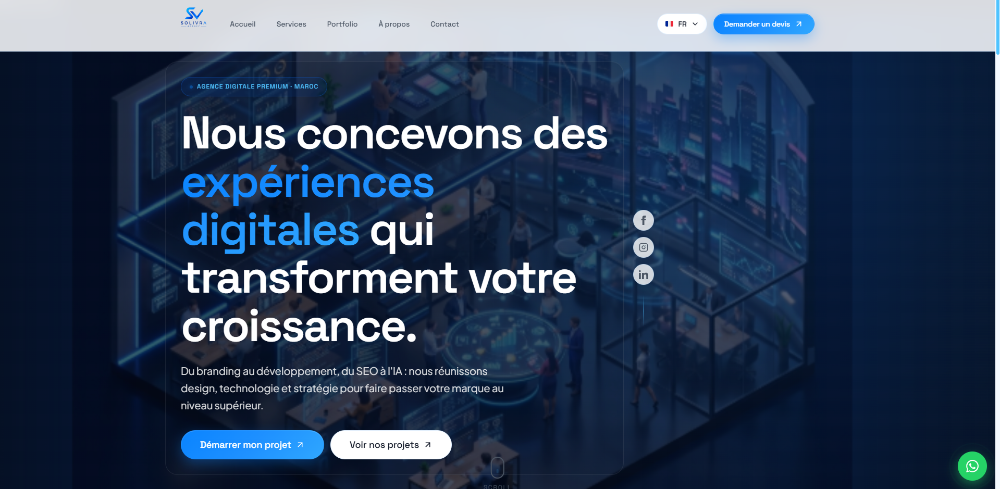
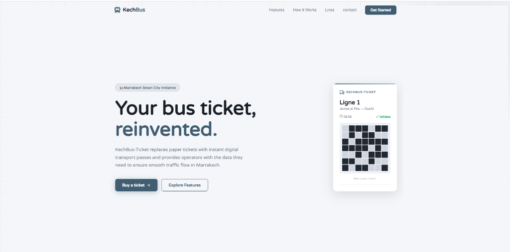
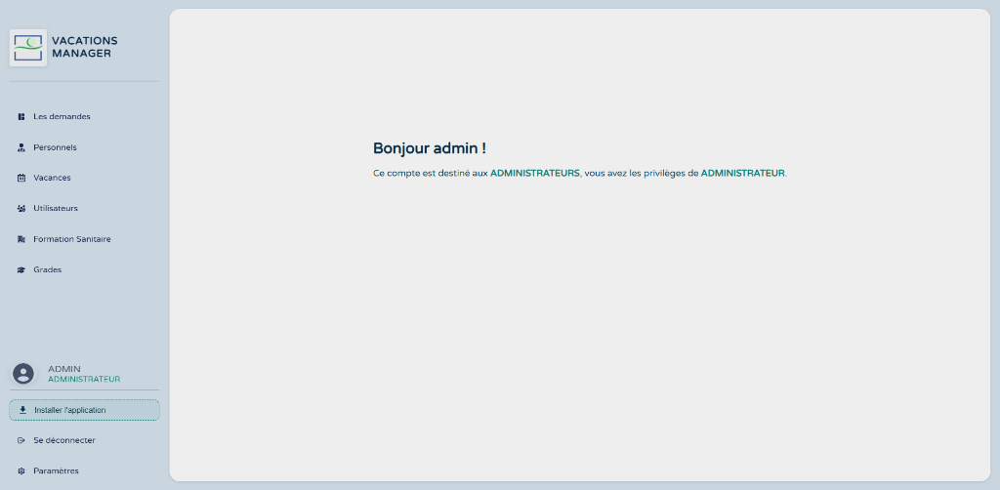

# Obaid Ait Mattou Portfolio 🚀

[](https://nextjs.org/)
[](https://reactjs.org/)
[](https://www.typescriptlang.org/)
[](https://tailwindcss.com/)
[](https://vercel.com/)

A high-performance, modern, and interactive developer portfolio built with **Next.js**, **TypeScript**, and **Framer Motion**. Showcase of production-grade systems, AI applications, corporate platforms, and web engineering projects.

---

## 🌟 Overview

Welcome to my personal developer portfolio! This application is engineered to showcase my software engineering background, full-stack project case studies, core technical skills, and resume downloads in an elegant, responsive UI with smooth animations and dark/light theme options.

---

## ✨ Features

- 📱 **Fully Responsive Design**: Fluid grid and flexbox layouts optimized for mobile, tablet, and ultra-wide desktops.
- 🎨 **Modern Aesthetics**: Built with custom glassmorphism, subtle glows, typography systems, and HSL themes.
- 🌗 **Dark & Light Mode**: Seamless theme toggling with smooth transitions and system theme detection.
- ⚡ **Dynamic Micro-Animations**: Interactive hover states, spotlight cards, and entrance animations driven by Framer Motion.
- 📁 **Engineering Case Studies**: Detailed project pages (`/projects/[slug]`) highlighting architecture, challenges, and impact.
- 🛠️ **Skill Taxonomy**: Structured presentation of Frontend, Backend, Databases, and DevOps expertise.
- 📄 **CV Download Engine**: Direct one-click download access to latest curriculum vitae (`/cv/Obaid_Ait_Mattou_CV.pdf`).
- ⚡ **SEO & Performance**: Pre-rendered static generation (SSG), OpenGraph cards, schema markup, and Next.js Image optimization.

---

## 🛠️ Tech Stack

### 💻 Frontend
- **Framework**: [Next.js 15](https://nextjs.org/) (App Router)
- **Library**: [React 19](https://react.dev/)
- **Language**: [TypeScript](https://www.typescriptlang.org/)
- **Styling**: [Tailwind CSS](https://tailwindcss.com/)
- **Animations**: [Framer Motion](https://www.framer.com/motion/)

### ⚙️ Backend & Database
- **Runtime**: [Node.js](https://nodejs.org/) & Express / NestJS
- **Database / ORM**: PostgreSQL, Prisma ORM, SQLite
- **API Architecture**: REST APIs, WebSockets, OpenAI API

### 🚀 Deployment & Infrastructure
- **Hosting**: [Vercel](https://vercel.com/)
- **Version Control**: Git & GitHub

---

## 📂 Featured Projects

### 1. 🌍 AtlasForecast
> **Category**: Weather Platform  
> **Technologies**: Next.js, React, TypeScript, Tailwind CSS, OpenWeather API, Meteoblue API, Leaflet, Chart.js, Vercel

A modern weather forecasting platform providing real-time weather, 7-day forecasts, interactive GIS maps, and climate insights with a clean responsive interface.



---

### 2. 🏝️ Trip2Go
> **Category**: Travel & Tourism  
> **Technologies**: Next.js, TypeScript, Tailwind CSS, Node.js, PostgreSQL, Prisma, REST API

A premium travel booking platform for Morocco featuring excursion reservations, guided tours, interactive destination maps, and reservation management.


---

### 3. ⚡ ContentFlow
> **Category**: AI SaaS Platform  
> **Technologies**: Next.js, React, TypeScript, Prisma ORM, SQLite, Tailwind CSS, OpenAI API, Authentication

An AI-powered content publishing platform allowing users to generate, organize, edit, and publish content efficiently through a modern dashboard.



---

### 4. 💧 AQWAFLEX
> **Category**: Corporate Website  
> **Technologies**: Next.js, React, Tailwind CSS, TypeScript, Framer Motion

A professional corporate website showcasing premium bedding, foam, and salon products with responsive design, modern UI, and SEO optimization.



---

### 5. 🚀 SOLIVRA Agency
> **Category**: Digital Agency  
> **Technologies**: Next.js, React, Tailwind CSS, TypeScript

A business website for a digital agency presenting services, portfolio showcases, client inquiry forms, and optimized web performance.



---

### 6. 🚌 KechBus Ticket
> **Category**: Transportation  
> **Technologies**: React.js, Node.js, Express.js, PostgreSQL, Leaflet, REST API

An online bus ticket reservation system with real-time schedules, interactive seat allocation, booking management, and route visualization.



---

### 7. 📅 Vacations Manager
> **Category**: Business Management  
> **Technologies**: React.js, JavaScript, Node.js, Express.js, PostgreSQL

A vacation and leave management application for companies with employee requests, multi-tier approvals, team availability calendars, and administration dashboards.



---

## 💻 Getting Started & Installation

### Prerequisites
Make sure you have [Node.js](https://nodejs.org/) (v18.x or higher) and `npm` installed on your machine.

### Installation Steps

1. **Clone the repository**:
   ```bash
   git clone https://github.com/ObaidDev-Ait/obaid-portfolio.git
   cd obaid-portfolio
   ```

2. **Install dependencies**:
   ```bash
   npm install
   ```

3. **Run the development server**:
   ```bash
   npm run dev
   ```

4. **Open in browser**:
   Navigate to [http://localhost:3000](http://localhost:3000) to view the application live.

### Production Build
To create an optimized production build:
```bash
npm run build
npm run start
```

---

## 📬 Contact & Connect

- **Name**: Obaid Ait Mattou
- **Email**: [obaidait2025@gmail.com](mailto:obaidait2025@gmail.com)
- **GitHub**: [@ObaidDev-Ait](https://github.com/ObaidDev-Ait)
- **LinkedIn**: [Obaid Ait Mattou](https://linkedin.com/in/obaid-ait-mattou-2b058130b)

---

## 📄 License

This project is open-source and available under the [MIT License](LICENSE).
